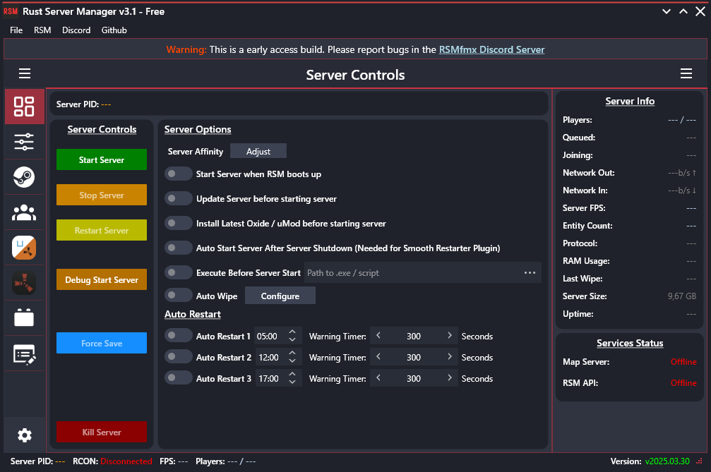

# Rust Server Manager FMX

## Free Since 2025.03.30 [Why???](https://github.com/AdriaanBoshoff/RSMfmx_v3.1/blob/main/why-free.md)

Rust Server Manager allows you to create and manage dedicated Rust Game servers on windows within a GUI.

Join the [RSMfmx Discord Server](https://discord.gg/HraUQhtUcN)

## ICS Branch

This branch is an attempt to convert from sgcWebsockets to the [ICS](https://wiki.overbyte.eu/wiki/index.php/Main_Page) library.

## Depends On

All dependencies are now free.

* Internet Component Suite (ICS) (Free) from [overbyte.eu](https://www.esegece.com/websockets) or [Getit](https://getitnow.embarcadero.com/ics-for-fmx-and-vcl-for-delphi/) (Preferred)
* Delphi 12.3 ([Delphi 12 CE (Free)](https://www.embarcadero.com/products/delphi/starter) should also work)

## Libs Embedded

* [DelphiBigNumbers](https://github.com/rvelthuis/DelphiBigNumbers) - Used by MMDB Reader
* [FastMM5](https://github.com/pleriche/FastMM5) - Memory Manager
* [Horse](https://github.com/HashLoad/horse) - API Framework
* [IPTypesX](https://github.com/optinsoft/MMDBReader/blob/master/Source/IPTypesX.pas) - Used by MMDB Reader
* [MMDB Reader](https://github.com/optinsoft/MMDBReader/tree/master) - Get IP info
* [XSuperObject](https://github.com/onryldz/x-superobject) - Save / Load delphi objects as / from JSON

## Usage Instructions

1. Download the latest version from [Releases](https://github.com/AdriaanBoshoff/RSMfmx_v3.1/releases).
2. Extract anywhere on your windows machine.
3. Launch RSMfmx.
4. Navigate to the server installer and install the server.
5. (Optional) Install uMod or CarbonMod.
6. (Optional) Install plugins.
7. Configure server using server config editor.
8. Start server via the server controls panel.

## Misc

Icons Provided by [icons8](https://icons8.com/)
